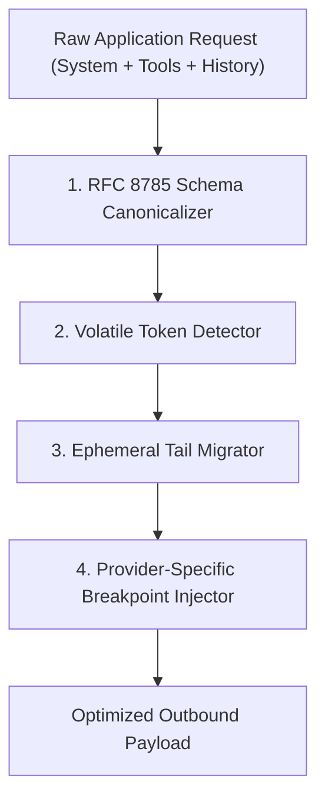

# Architecture & Design Principles

CacheAlign operates as a high-performance optimization filter that intercepts outbound model requests immediately before serialization.



---

## 1. RFC 8785 JSON Canonicalization Scheme (JCS)

To ensure that tool definitions produce deterministic byte streams, CacheAlign applies **RFC 8785**:

1. **Deterministic Key Ordering**: Dictionaries are recursively sorted in lexicographical order by UTF-16 code unit values.
2. **Tool Identifier Sorting**: The top-level tool list is sorted alphabetically by tool name.
3. **Whitespaces & Escapes**: Non-significant whitespace is normalized, and unicode character escapes are standardized.

```python
# Before CacheAlign (Node 1 vs Node 2 output differing JSON keys):
# Node 1: {"name": "query", "description": "search"}
# Node 2: {"description": "search", "name": "query"}

# After CacheAlign (Guaranteed byte-identical output across all nodes):
{"description": "search", "name": "query"}
```

---

## 2. Volatile Detection & Ephemeral Tail Migration

### The Volatile Pattern Scanner
CacheAlign inspects the invariant sections of your prompt (system prompt and early conversation turns) using regular expressions targeting:
* **Timestamps and Dates**: `\b\d{4}-\d{2}-\d{2}[ T]\d{2}:\d{2}:\d{2}`, `Current Time:`, `Now:`, etc.
* **Turn & Step Counters**: `Turn \d+ of \d+`, `Step: \d+`
* **Session & Request IDs**: `Session-ID: ...`, `Trace: ...`

### Ephemeral Tail Migration
When volatile lines are detected:
1. They are excised from the static system prompt.
2. The remaining static prompt is preserved as a clean, immutable string.
3. The extracted dynamic variables are compiled into a synthesized context header:
   ```markdown
   [Context: Current Time: 2026-10-03 10:14:02; Turn: 3]
   ```
4. This header is appended to the **tail** of the final user message.

### Semantic Preservation
Because modern LLMs attend across the entire context window, moving the timestamp from line 2 to the dynamic tail preserves identical reasoning capabilities:
* The model still knows the current date and time.
* The 25,000-token system prompt remains $100\%$ byte-stable from turn 1 to turn 50.

---

## 3. Dynamic Multi-Breakpoint Allocation (Anthropic)

Anthropic Claude limits requests to a maximum of **4 cache breakpoints** (`cache_control: {"type": "ephemeral"}`). CacheAlign allocates these strategically:

1. **Breakpoint 1 (System Prompt)**: Placed on the static system prompt (if $\ge 1,024$ tokens).
2. **Breakpoint 2 (Tools Schema)**: Placed on the final tool in the canonicalized tools array.
3. **Breakpoint 3 (History N-2)**: Placed on the user message 2 turns prior. As the conversation grows, this ensures that completed historical turns remain cached while only the latest turn is evaluated.
4. **Breakpoint 4 (Reference Material)**: Reserved for large static documents or RAG context chunks.

---

## 4. Latency Profile

CacheAlign is engineered to operate with near-zero latency overhead:

* **In-Process Python SDK**: $\le 0.7\text{ ms}$ overhead per request (in-memory string partitioning and dictionary sorting).
* **Rust Sidecar Proxy**: $\le 1.2\text{ ms}$ p99 overhead (asynchronous tokio pipeline with zero allocation parsing).

Because prompt caching reduces Time-to-First-Token (TTFT) by $400\text{ ms}$ to $1,500\text{ ms}$, CacheAlign produces a **net latency reduction of over 50%**.

---

## 5. Security & Privacy Guarantee

* **Zero External Data Egress**: All prompt inspection, schema canonicalization, and token reordering occur strictly **in-memory within your process or VPC**.
* **Zero Telemetry Leaks**: CacheAlign never logs or transmits raw prompt content, user messages, or tool arguments. Only aggregated numerical counters (total tokens, cached tokens, estimated dollars saved) are tracked locally.